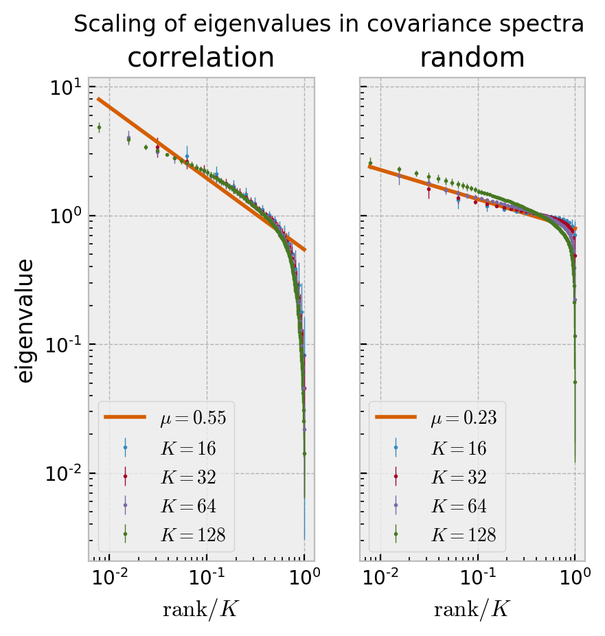

```python
import matplotlib.pyplot as plt
import numpy as np
```


```python
import neurenorm
```


```python
# this cell is used to quickly reload the python file
from importlib import reload
reload(neurenorm)
```


    <module 'neurenorm' from '/Users/mr/Uni/neuronal-correlations/neurenorm.py'>


```python
data = neurenorm.load_data("data.tif")
```


```python
rdata = neurenorm.perform_renormalization(data, times = 8)
```


```python
x = np.linspace(0, 1, len(data[0]))

for subdata in rdata[::2]:
    plt.plot(x, subdata[0])
    
plt.show()
```





```python
for subdata in rdata[::2]:
    x, y = neurenorm.make_histogram(subdata)
    plt.yscale('log')
    plt.xlim(-0.5,8.5)
    plt.plot(x, y)
plt.show()
```


```python
data.shape
```


    (891, 18000)


